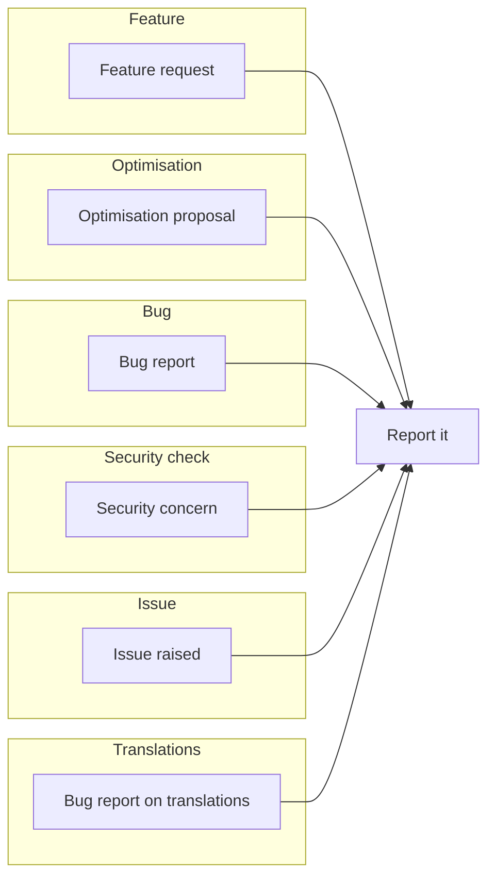

# Contribution intake flow

```mermaid
flowchart LR
    subgraph L1[Feature]
        A[Feature request]
    end
    subgraph L2[Optimisation]
        B[Optimisation proposal]
    end
    subgraph L3[Bug]
        C[Bug report]
    end
    subgraph L4[Security check]
        D[Security concern]
    end
    subgraph L5[Issue]
        E[Issue raised]
    end
    subgraph L6[Translations]
        F[Bug report on translations]
    end

    A --> G[Report it]
    B --> G
    C --> G
    D --> G
    E --> G
    F --> G
```
