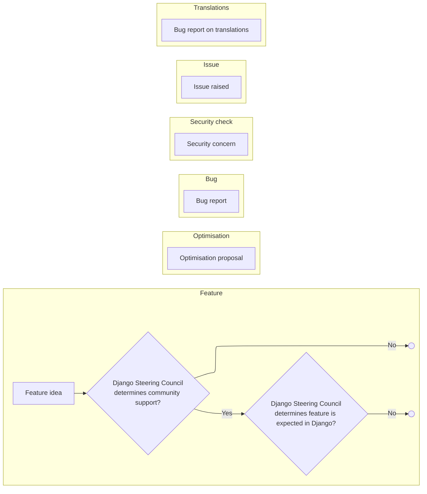

# Contribution intake flow

```mermaid
%%{init: {"flowchart": {"defaultRenderer": "elk"}} }%%
flowchart LR
    subgraph L1[Feature]
        direction TB
        subgraph L1a[ ]
            direction LR
            A[Feature idea] --> A2{Django Steering Council<br/>determines community support?}
            A2 -->|Yes| A4{Django Steering Council<br/>determines feature is expected in Django?}
        end
        A2 -->|No| A3(( ))
        A4 -->|No| A5(( ))
    end
    style L1a fill:none,stroke:none
    subgraph L2[Optimisation]
        B[Optimisation proposal]
    end
    subgraph L3[Bug]
        C[Bug report]
    end
    subgraph L4[Security check]
        D[Security concern]
    end
    subgraph L5[Issue]
        E[Issue raised]
    end
    subgraph L6[Translations]
        F[Bug report on translations]
    end
```
